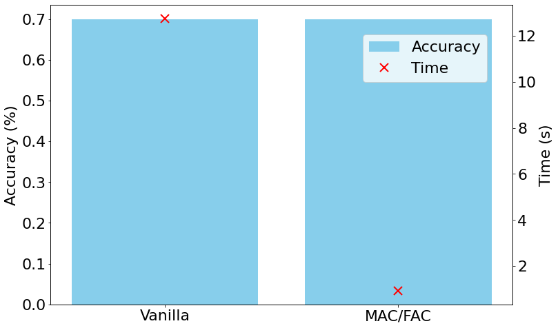

MACFAC
======

Importing Packages
------------------

.. code:: ipython3

    from mlots import kNNClassifier
    from sklearn.model_selection import GridSearchCV
    from scipy.io import arff
    import matplotlib.pyplot as plt
    import pandas as pd
    import numpy as np
    import warnings
    from sklearn.metrics import accuracy_score
    warnings.filterwarnings("ignore")
    import matplotlib
    import time
    %matplotlib inline

.. code:: ipython3

    font = {'size'   : 22}
    
    matplotlib.rc('font', **font)

Loading Data
------------

| Here we are loading the ``PickupGestureWiimoteZ`` dataset.
| The datasets are in two ``.arff`` files with pre-defined train and
  test splits.
| The following code reads the two files stores the ``X`` (time-series
  data) and ``y`` (labels), into their specific train and test sets.
  \**\*

.. code:: ipython3

    name = "PickupGestureWiimoteZ"
    
    dataset = arff.loadarff(f'../input/{name}/{name}_TRAIN.arff'.format(name=name))[0]
    X_train = np.array(dataset.tolist(), dtype=np.float32)
    y_train = X_train[: , -1]
    X_train = X_train[:, :-1]
    
    dataset = arff.loadarff(f'../input/{name}/{name}_TEST.arff'.format(name=name))[0]
    X_test = np.array(dataset.tolist(), dtype=np.float32)
    y_test = X_test[: , -1]
    X_test = X_test[:, :-1]
    
    #Converting target from bytes to integer
    y_train = [int.from_bytes(el, "little") for el in y_train]
    y_test = [int.from_bytes(el, "little") for el in y_test]
    
    #Filling NaN/missing values with 0.0
    X_train = np.nan_to_num(X_train, 0.0)
    X_test = np.nan_to_num(X_test, 0.0)
    
    X_train.shape, X_test.shape

.. parsed-literal::

    ((50, 361), (50, 361))

===== =========== =========
Set   Sample size TS length
===== =========== =========
Train 50          361
Test  50          361
===== =========== =========

Evaluating kNNClassifier for full-k-NN-DTW
------------------------------------------

Model tuning
~~~~~~~~~~~~

| ``kNNClassifier`` model allows us to work with a more complex distance
  measure like ``DTW`` in with or without ``MAC/FAC`` strategy.
| Here, we would use ``GridSearchCV`` algorithm from the ``sklearn``
  package to find the best set of parameters of the model over the
  dataset.
| The model tuning would be done **only** over the ``train`` set of the
  dataset. \**\*

.. code:: ipython3

    #Setting up the warping window grid of the DTW measure
    
    dtw_params = []
    for w_win in range(5,10,3):
        dtw_params.append(
        {
            "global_constraint": "sakoe_chiba",
            "sakoe_chiba_radius": w_win
        }
        )
    dtw_params

.. parsed-literal::

    [{'global_constraint': 'sakoe_chiba', 'sakoe_chiba_radius': 5},
     {'global_constraint': 'sakoe_chiba', 'sakoe_chiba_radius': 8}]

.. code:: ipython3

    #Setting up the param grid for the kNNClassifier model with the DTW params
    
    param_grid = {
        "n_neighbors": np.arange(1,10,2),
        "metric_params" : dtw_params
    }
    param_grid

.. parsed-literal::

    {'n_neighbors': array([ 1,  3,  5,  7,  9]),
     'metric_params': [{'global_constraint': 'sakoe_chiba',
       'sakoe_chiba_radius': 5},
      {'global_constraint': 'sakoe_chiba', 'sakoe_chiba_radius': 8},
      {'global_constraint': 'sakoe_chiba', 'sakoe_chiba_radius': 11}]}

.. code:: ipython3

    #Executing the GridSearchCv over the kNNClassifier model with the supplied param_grid.
    
    model = kNNClassifier(mac_metric="dtw")
    gscv = GridSearchCV(model, param_grid=param_grid, cv=5,
                        scoring="accuracy", n_jobs=-1).fit(X_train,y_train)

.. code:: ipython3

    #Displaying the best parameters of kNNClassifier within the search grid.
    
    best_param = gscv.best_params_
    best_score = gscv.best_score_
    print("Best Parameters: ", best_param)
    print("Best Accuracy: ", best_score)

.. parsed-literal::

    Best Parameters:  {'metric_params': {'global_constraint': 'sakoe_chiba', 'sakoe_chiba_radius': 5}, 'n_neighbors': 1}
    Best Accuracy:  0.62

Evaluation of tuned model
~~~~~~~~~~~~~~~~~~~~~~~~~

| The parameters displayed above are optimal set of parameters for the
  ``kNNClassifier`` model over ``PickupGestureWiimoteZ`` dataset.
| Our next task is then to train the ``kNNClassifier`` model over the
  ``train`` set with the optimal set of parameters, and evaluate the
  model over the held-out ``test`` set. \**\*

.. code:: ipython3

    start = time.time()
    model = kNNClassifier(**best_param,mac_metric="dtw",
                               n_jobs=1).fit(X_train,y_train)
    
    y_hat = model.predict(X_test)
    acc = accuracy_score(y_test, y_hat)
    end = time.time()
    elapsed = end-start

.. code:: ipython3

    print("Model Accuracy: ", round(acc, 2))
    print("Time: ", round(elapsed, 2))

.. parsed-literal::

    Model Accuracy:  0.7
    Time:  12.75

We achieve an accuracy of 70% by full k-NN-DTW model. The model takes
12.75 :math:`s` to complete the task.

Using MAC/FAC Strategy
----------------------

| Here we would look into speeding up the classification of the
  kNNClassifer model by using the MAC/FAC strategy.
| The classification would happen in two stages: - MAC stage: The model
  retrieves a candidate subset of size ``mac_neighbors`` using the
  ``mac_metric``. - FAC stage: The model retrieves the closest
  ``n_neighbors`` from the candidates set using ``DTW``, and consider
  them for prediction/classification.

--------------

Model tuning
~~~~~~~~~~~~

.. code:: ipython3

    param_grid = {
        "n_neighbors": np.arange(1,6,2),
        "mac_neighbors": np.arange(20,40,5)
    }
    param_grid

.. parsed-literal::

    {'n_neighbors': array([ 1,  3,  5]),
     'mac_neighbors': array[20, 25, 30, 35]}

.. code:: ipython3

    #We use the the same metric_params as supplied to previous model, for fair analysis.
    metric_params = {'global_constraint': 'sakoe_chiba', 'sakoe_chiba_radius': 5}
    
    model = kNNClassifier(mac_metric="euclidean",
                         metric_params=metric_params)
    gscv_mf = GridSearchCV(model, param_grid=param_grid, cv=5,
                        scoring="accuracy", n_jobs=-1).fit(X_train,y_train)

.. code:: ipython3

    #Displaying the best parameters of kNNClassifier within the search grid.
    
    best_param_mf = gscv_mf.best_params_
    best_score_mf = gscv_mf.best_score_
    print("Best Parameters: ", best_param_mf)
    print("Best Accuracy: ", best_score_mf)

.. parsed-literal::

    Best Parameters:  {'mac_neighbors': 20, 'n_neighbors': 1}
    Best Accuracy:  0.7

Evaluation of tuned model
~~~~~~~~~~~~~~~~~~~~~~~~~

.. code:: ipython3

    start = time.time()
    model_mf = kNNClassifier(**best_param_mf,mac_metric="euclidean",
                               metric_params=metric_params, n_jobs=1).fit(X_train,y_train)
    
    y_hat_mf = model_mf.predict(X_test)
    acc_mf = accuracy_score(y_test, y_hat_mf)
    end = time.time()
    elapsed_mf = end-start

.. code:: ipython3

    print("Model Accuracy: ", round(acc_mf, 2))
    print("Retrieval Time: ", round(elapsed_mf, 2))

.. parsed-literal::

    Model Accuracy:  0.7
    Retrieval Time:  0.93

kNNClassifer w/ MAC/FAC strategy achieves the **same classification
accuracy** of full-kNN-DTW. However, the model is **10 times faster**
than the previous one.

Comparison
----------

| Here we do bar-plot that would illustrate the performance of the
  ``kNNClassifier`` model with **default** parameters against the model
  with the **tuned** parameters.
| The ``matplotlib.pyplot`` is employed for this task. \**\*

.. code:: ipython3

    models = ["Vanilla", "MAC/FAC"]
    fig = plt.figure(figsize=(12,8))
    ax = fig.add_subplot(111)
    ax.bar(models, [acc,acc_mf], color="skyblue", label="Accuracy")
    ax2 = ax.twinx()
    ax2.plot(ax.get_xticks(),
             [elapsed,elapsed_mf],
             color='r',
             markersize=12,
             marker="x",
             mew=2,
             linewidth=0, label="Time")
    fig.legend(loc=(0.65,0.75))
    ax.set_ylabel('Accuracy (%)')
    ax2.set_ylabel('Time (s)')
    plt.show()

