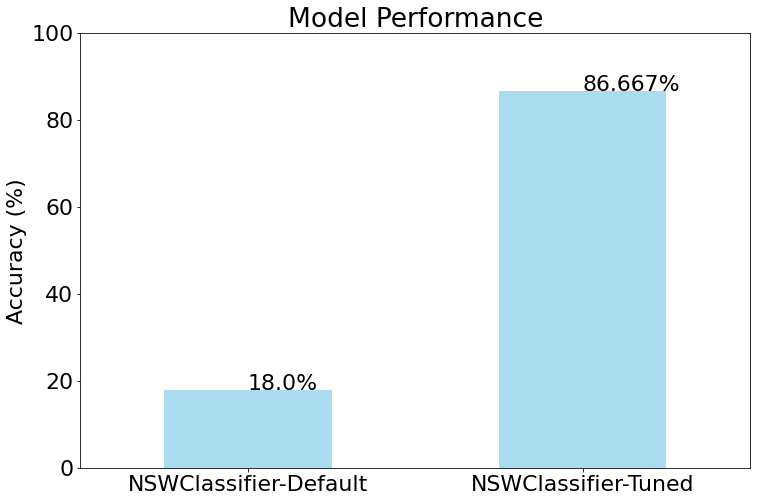

NSWClassifier
=============

Importing Packages
------------------

.. code:: ipython3

    from mlots import NSWClassifier
    from sklearn.model_selection import GridSearchCV
    from scipy.io import arff
    import matplotlib.pyplot as plt
    import pandas as pd
    import numpy as np
    import warnings
    from sklearn.metrics import accuracy_score
    warnings.filterwarnings("ignore")
    import matplotlib
    %matplotlib inline

.. code:: ipython3

    font = {'size'   : 22}
    
    matplotlib.rc('font', **font)

Loading Data
------------

| Here we are loading the ``SyntheticControl`` dataset.
| The datasets are in two ``.arff`` files with pre-defined train and
  test splits.
| The following code reads the two files stores the ``X`` (time-series
  data) and ``y`` (labels), into their specific train and test sets.
  \**\*

.. code:: ipython3

    name = "SyntheticControl"
    
    dataset = arff.loadarff(f'input/{name}/{name}_TRAIN.arff'.format(name=name))[0]
    X_train = np.array(dataset.tolist(), dtype=np.float32)
    y_train = X_train[: , -1]
    X_train = X_train[:, :-1]
    
    dataset = arff.loadarff(f'input/{name}/{name}_TEST.arff'.format(name=name))[0]
    X_test = np.array(dataset.tolist(), dtype=np.float32)
    y_test = X_test[: , -1]
    X_test = X_test[:, :-1]
    
    #Converting target from bytes to integer
    y_train = [int.from_bytes(el, "little") for el in y_train]
    y_test = [int.from_bytes(el, "little") for el in y_test]
    X_train.shape, X_test.shape

.. parsed-literal::

    ((300, 60), (300, 60))

===== =========== =========
Set   Sample size TS length
===== =========== =========
Train 300         60
Test  300         60
===== =========== =========

Evaluating NSW
--------------

Default parameters
~~~~~~~~~~~~~~~~~~

| We would employ ``NSWClassifier`` model from the ``mlots`` python
  package.
| First, the model is evaluated with default parameters over the
  ``SyntheticControl`` dataset. \**\*

.. code:: ipython3

    model_default = NSWClassifier(random_seed=42).fit(X_train,y_train)

.. parsed-literal::

    100%|██████████| 300/300 [00:00<00:00, 4088.23it/s]

.. parsed-literal::

    Model is fitted with the provided data.

.. parsed-literal::

    

.. code:: ipython3

    y_hat_default = model_default.predict(X_test)
    acc_default = accuracy_score(y_test, y_hat_default)
    print("Model accuracy with default parameters: ", round(acc_default, 2))

.. parsed-literal::

    100%|██████████| 300/300 [00:00<00:00, 3925.39it/s]

.. parsed-literal::

    Model accuracy with default parameters:  0.18

.. parsed-literal::

    

The accuracy of the model is **48%**, which is poorer than random
guessing.

Model tuning
~~~~~~~~~~~~

| ``NSWClassifier`` model allows us to work with a more complex distance
  measure like ``DTW``.
| Here, we would use ``GridSearchCV`` algorithm from the ``sklearn``
  package to find the best set of parameters of the model over the
  dataset.
| The model tuning would be done **only** over the ``train`` set of the
  dataset. \**\*

.. code:: ipython3

    #Setting up the warping window grid of the DTW measure
    
    dtw_params = []
    for w_win in range(1,15,2):
        dtw_params.append(
        {
            "global_constraint": "sakoe_chiba",
            "sakoe_chiba_radius": w_win
        }
        )
    dtw_params

.. parsed-literal::

    [{'global_constraint': 'sakoe_chiba', 'sakoe_chiba_radius': 1},
     {'global_constraint': 'sakoe_chiba', 'sakoe_chiba_radius': 3},
     {'global_constraint': 'sakoe_chiba', 'sakoe_chiba_radius': 5},
     {'global_constraint': 'sakoe_chiba', 'sakoe_chiba_radius': 7},
     {'global_constraint': 'sakoe_chiba', 'sakoe_chiba_radius': 9},
     {'global_constraint': 'sakoe_chiba', 'sakoe_chiba_radius': 11},
     {'global_constraint': 'sakoe_chiba', 'sakoe_chiba_radius': 13}]

.. code:: ipython3

    #Setting up the param grid for the NSWClassifier model with the DTW params
    
    param_grid = {
        "f": np.arange(1,50,5),
        "m": np.arange(1,20,2),
        "k": np.arange(1,12,2),
        "metric_params" : dtw_params
    }
    param_grid

.. parsed-literal::

    {'f': array([ 1,  6, 11, 16, 21, 26, 31, 36, 41, 46]),
     'm': array([ 1,  3,  5,  7,  9, 11, 13, 15, 17, 19]),
     'k': array([ 1,  3,  5,  7,  9, 11]),
     'metric_params': [{'global_constraint': 'sakoe_chiba',
       'sakoe_chiba_radius': 1},
      {'global_constraint': 'sakoe_chiba', 'sakoe_chiba_radius': 3},
      {'global_constraint': 'sakoe_chiba', 'sakoe_chiba_radius': 5},
      {'global_constraint': 'sakoe_chiba', 'sakoe_chiba_radius': 7},
      {'global_constraint': 'sakoe_chiba', 'sakoe_chiba_radius': 9},
      {'global_constraint': 'sakoe_chiba', 'sakoe_chiba_radius': 11},
      {'global_constraint': 'sakoe_chiba', 'sakoe_chiba_radius': 13}]}

.. code:: ipython3

    #Executing the GridSearchCV over the NSWClassifier model with the supplied param_grid.
    
    model = NSWClassifier(metric="dtw",random_seed=42)
    gscv = GridSearchCV(model, param_grid=param_grid, cv=10,
                        scoring="accuracy", n_jobs=-1).fit(X_train,y_train)

.. code:: ipython3

    #Displaying the best parameters of NSWClassifier within the search grid.
    
    best_param = gscv.best_params_
    best_score = gscv.best_score_
    print("Best Parameters: ", best_param)
    print("Best Accuracy: ", best_score)

.. parsed-literal::

    Best Parameters:  {'f': 1, 'k': 1, 'm': 17, 'metric_params': {'global_constraint': 'sakoe_chiba', 'sakoe_chiba_radius': 11}}
    Best Accuracy:  0.9133333333333334

Evaluation of tuned model
~~~~~~~~~~~~~~~~~~~~~~~~~

| The parameters displayed above are optimal set of parameters for the
  ``NSWClassifier`` model over ``SyntheticControl`` dataset.
| Our next task is then to train the ``NSWClassifier`` model over the
  ``train`` set with the optimal set of parameters, and evaluate the
  model over the held-out ``test`` set. \**\*

.. code:: ipython3

    model_tuned = NSWClassifier(**best_param,metric="dtw",random_seed=42).fit(X_train,y_train)

.. code:: ipython3

    y_hat_tuned = model_tuned.predict(X_test)
    acc_tuned = accuracy_score(y_test, y_hat_tuned)
    print("Model accuracy with tuned parameters: ", round(acc_tuned, 2))

.. parsed-literal::

    100%|██████████| 300/300 [00:01<00:00, 254.14it/s]

.. parsed-literal::

    Model accuracy with tuned parameters:  0.87

.. parsed-literal::

    

Comparison
----------

| Here we do bar-plot that would illustrate the performance of the
  ``NSWClassifier`` model with **default** parameters against the model
  with the **tuned** parameters.
| The ``matplotlib.pyplot``\ is employed for this task. \**\*

.. code:: ipython3

    acc =  [acc_default*100,acc_tuned*100]
    rows = ["NSWClassifier-Default", "NSWClassifier-Tuned"]
    
    df = pd.DataFrame({"models": rows, "Accuracy":acc})
    
    fig = plt.figure()
    ax = df['Accuracy'].plot(kind="bar", figsize=(12, 8), alpha=0.7,
                     color=[
                         'skyblue'
                     ], label = "Accuracy")
    
    ax.set_xticklabels(df['models'])
    ax.set_ylabel("Accuracy (%)")
    
    ax.set_ylim(0,100)
    
    plt.setp(ax.xaxis.get_majorticklabels(), rotation=0)
    for i,a in enumerate(acc):
        ax.text(i,a,str(round(a,3))+"%")
    plt.text
    plt.title("Model Performance")
    plt.show()

